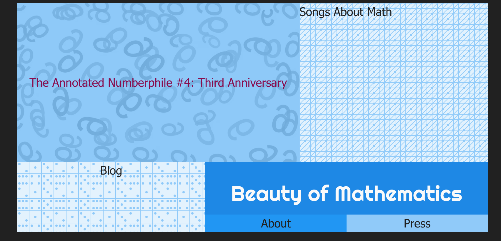

Well, is it sad that it took me time to understand this? It is a little confusing and I want to clear it up for people who don’t know when to use it. This is something that most devs won’t have problems with. So this is for the few of us who need a bit of an explainer.

### getCollection

You use this when you need to grab an array of your content collection’s posts. You are going to use this in your getStaticPaths() when you are creating dynamic routes. Such as generating your slugs for individual blog posts. Or creating tag and category archives for your blog.

I’ve also used this to grab data from my most recent post. I do this by awaiting my blog collection. Sorting by date and then using slice to grab the top post.

```
const allPosts = (await getCollection("blog"))
 .filter((post) => !post.data.draft)
 .sort((a, b) => b.data.pubDate.valueOf() - a.data.pubDate.valueOf())
 .slice(0, 1);
```

This is how I get the title and link to my most recent post on my home page in the top left corner.



### collectionEntry

This is only how I understand this. So I’m not sure if this is quite the right explanation. But, use this to get the types of your props in your content collection. Astro does this to help you. You would be using this most likely in your components.

For example, I use this to get the frontmatter properties of my posts in my blog collection. So that I can use them to create the layout for each post.

```
interface Props {
 entry: CollectionEntry<"blog">;
}
```

Here I am grabbing the modified date and title of my post.

```
            <div>
   <!-- Article Title  -->
             <small>
               <time datetime={new Date(entry.data.updatedDate).toISOString()}>
                 Updated on {
                   new Date(entry.data.updatedDate).toLocaleDateString(
                     undefined,
                     {
                       dateStyle: "medium",
                       timeZone: "UTC",
                     }
                   )
                 }
               </time>
             </small>
             <h1>{entry.data.title}</h1>
           </div>
```

Without using collectionEntry, entry.data.updatedDate and entry.data.title would have red lines. Because TypeScript needs to know their types.

There is also getEntry and getEntries.

You use getEntry to grab data from a specific post in your collection. By calling that collection and using the post ID. This is[ the example from the Astro Docs](https://docs.astro.build/en/reference/modules/astro-content/#getentry). This is a single entry.

It is also used to get the data from a [field with a reference](https://www.youtube.com/watch?v=Fcw4c3wzm7I) from your content collection. You use the ID of what you are referencing in your frontmatter. Then when you are calling that data in an .astro file you use getEntry if you are only referencing a single ID. Such as an author in an author collection.

You would using something like this in the code fences to grab that data.

```
const authorName = await getEntry(entry.data.author);
```

You will find that getEntries is similar but gets an array of entries. In the fontmatter you use multiple IDs in the reference field. This is what I use on Trauma Dump to grab all the campaigns related to each player.

```
---
import { getCollection, type CollectionEntry } from "astro:content";
import BaseHead from "../../components/BaseHead.astro";
import Header from "../../components/Header.astro";
import Footer from "../../components/Footer.astro";


import { getEntries } from "astro:content";

export async function getStaticPaths() {
 const blogEntries = await getCollection("players");
 return blogEntries.map((entry) => ({
   params: { slug: entry.id },
   props: { entry },
 }));
}


interface Props {
 entry: CollectionEntry<"players">;
}


const { entry } = Astro.props;


const campaignNames = await getEntries(entry.data.campaigns);
---
```

```
<ul class="border-l-2 border-blue-brand padding-left-xxl">
           {
             campaignNames.length > 0 ? (
               campaignNames.map((campaign) => (
                 <li class="capitalize">
                   <a
                     href={`/campaigns/${campaign.id}`}
                     title={`View posts from "${campaign.data.title}"`}
                   >
                     {campaign.data.title}
                   </a>
                 </li>
               ))
             ) : (
               <li>No campaigns found.</li>
             )
           }
         </ul>
```

I hope this clears up things for people if the docs didn’t quite make sense. Sometimes you need to see it in practice to get it. As always, [ping me](mailto:suzza@susansilver.net) if you have any questions.
