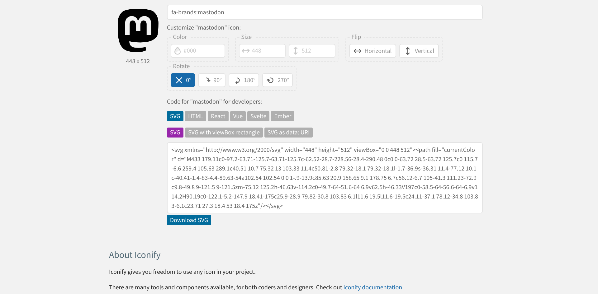

I was not prepared for this journey. Figuring out an icon set led me to rethink some preconceived notions. Those of design, performance, and accessibility  I will talk about these but first, let's document what happened. 

## My Experience Using Astro Icon

This is the[ most widely used integration for icons with Astro](https://github.com/natemoo-re/astro-icon#readme). The Astroship template uses this. That was my first experience with it. This NPM package will allow you to use the[ Iconify icon sets](https://icon-sets.iconify.design/). 

This is a great tool as it will embed inline SVG for you

I wanted this to work for me. Yet, it was not meant to be. Installing was easy enough. Playing around, I was able to get the icons to load.

My issue was that the icons would not obey my CSS. I used them in a horizontal navigation with my social profiles. For the life of me, I could not inline the unordered list items. 

The blog no longer has a social menu. I have a [personal website instead with all my profiles](https://susansilver.net).

## Trying Font Awesome

My next move was working with Font Awesome. This popular icon font has hundreds of free glyphs. This is a front-end developer's go-to resource. So I went. 

There are two methods for adding Font Awesome to your website or app. After creating a kit, you get a JavaScript that will give you access to all the free icons and styles. There is another option that [allows you to load them as a web font](https://fontawesome.com/docs/web/setup/host-yourself/webfonts).

There is an accessibility course on [edX worth taking](https://learning.edx.org/course/course-v1:W3Cx+WAI0.1x+3T2019/home). Pondering this, I started doing research on the[ accessibility of icon fonts and SVG](https://www.irigoyen.dev/blog/2021/02/17/stop-using-icon-fonts/).

Font Awesome has[ auto-accessibility](https://fontawesome.com/docs/web/dig-deeper/accessibility#making-icons-accessible-with-auto-accessibility) but only if you load it via the JavaScript method. 

I decided not to use it for the following reasons. 

## Why I’m No Longer Using Icon Fonts

I mentioned there were three considerations at the start of this chapter. These are my thoughts.

### Design

How many icons do you need? Some websites use icons in only a few ways. Also, they are loading all the icons. Even the ones that you are not using. Making them rather large. You don’t need to load a whole library.

### Performance

There is one thing that I’ve learned from Google’s PageSpeed Insights. Render-blocking resources slow down the loading of your website. Adding Font Awesome styles or scripts block the download until processed.

### Accessibility

It is easy to drop an icon using one of these fonts. We may forget that accessibility is something we still need to care about. There are a [few patterns that you can use for SVG elements](https://www.smashingmagazine.com/2021/05/accessible-svg-patterns-comparison/). It is not added as part of an icon font. 

## My Recommendation

Straight up, inline your SVG if you are going to only use a few. This reduces HTTP requests. Don’t forget to add the markup for accessibility. 

There are some other ways to load SVG that could apply to your specific situation. This [answer from Stack Overflow](https://stackoverflow.com/a/57665241) covers many of the use cases. It gives you strategies depending on the size of your files and how many you have. 

You can add icons yourself if you can’t get Astro-Icon to work. Or if that is your preference. Iconify will give you an option to copy the code for an inline SVG. You don’t need to download anything to use them. 

### Iconify Icons Inline SVG

