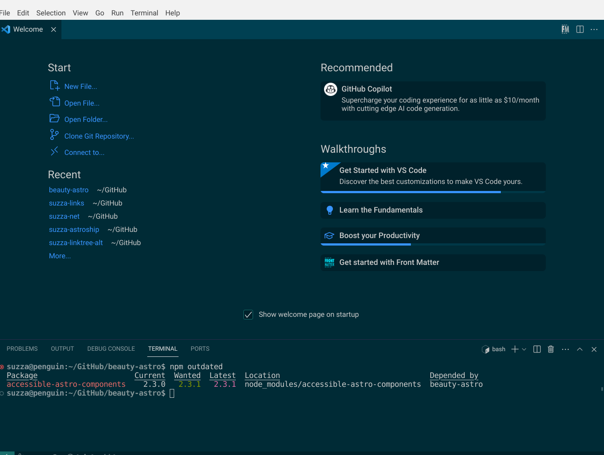
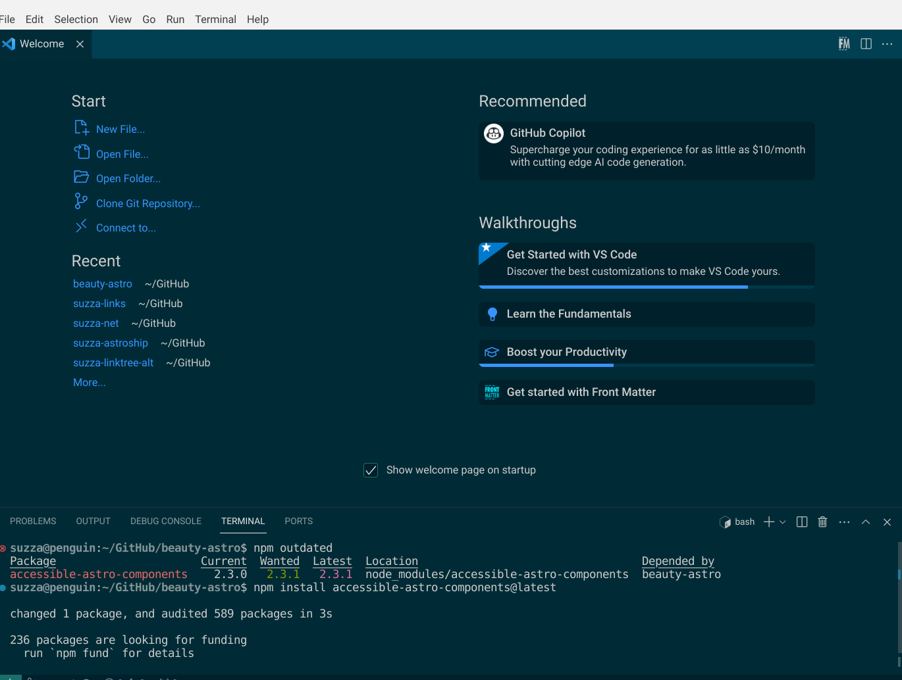

You will have to update your website sometimes. This is easy to do. First, run the command **npm outdated**. This will show you all the updates available. 

```sh
 npm outdated
```




To update run the command **npm install** with the name of the package followed by @latest. For example, to update [Accessible Astro Components](https://github.com/markteekman/accessible-astro-components) run the command:

```sh
 npm install accessible-astro-components@latest
```


