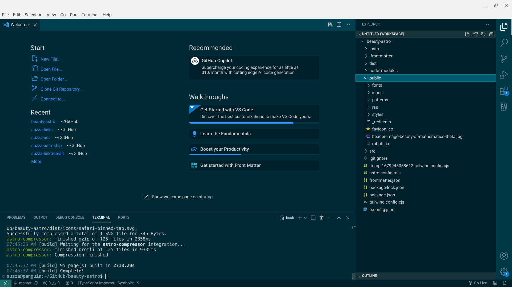
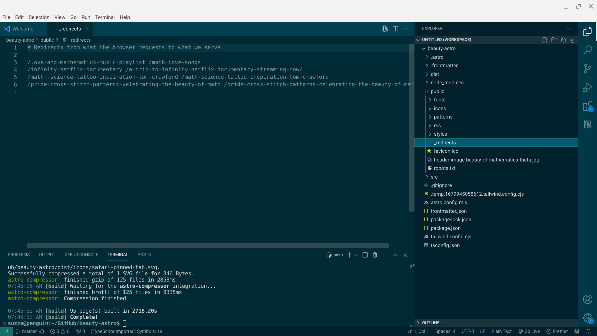

When a website or blog grows large enough you may delete some content. This creates a 404 error indicating a missing page. Sometimes this is the correct thing to do. The best option though is to redirect that content to a relevant page. 

There are times when I have made a typo in a URL that gets indexed by a search engine. Correcting it means that I need to create a 301 redirect to make sure the old URL points to the new one. Starting in[ Astro 3.0 there is a way to handle this](https://docs.astro.build/en/core-concepts/routing/#redirects). 

## How Astro Handles Redirects

### Meta Refresh

An option to create a meta tag that refreshes the page is the first option. This is the default if you are not using server-side rendering (SSR). Meta refresh happens at the page level. When the browser navigates to a page. If there is no delay, [Google will treat this as a permanent redirect](https://developers.google.com/search/docs/crawling-indexing/301-redirects#metarefresh). 

This is not recommended unless you do not have the option to use a server-side redirect. 

### 301 Redirect

This is the method that I learned for search engine optimization (SEO). It is the preference for search engines to index your website. A 301 redirect happens with an HTTP request. Your old page sends the 301 status code as a response. This informs the user-agent that your URL has changed. 

Astro will generate the config file for redirection for your host. Depending on [which SSR adapter you use](https://docs.astro.build/en/guides/server-side-rendering/#enabling-ssr-in-your-project). For example, if you use the Netlify adapter it will create the _redirects [file for you during the build step](https://docs.netlify.com/routing/redirects/#syntax-for-the-redirects-file). 

If you aren’t using SSR it is still possible to use server-side redirects. You have to make the config file yourself. 

## How to Create the _redirects File for Netlify

I already had 301 redirects for my website before I migrated to Netlify from Digital Ocean. I needed to carry that over to the new host. 

It is simple to do this yourself. 

- Create a _redirects file in your public directory
- It should not have any extension 

- Edit the file and add the /old-url press the spacebar and add the /new-url
- This will tell the server that you have moved the old URL to the new one. 

