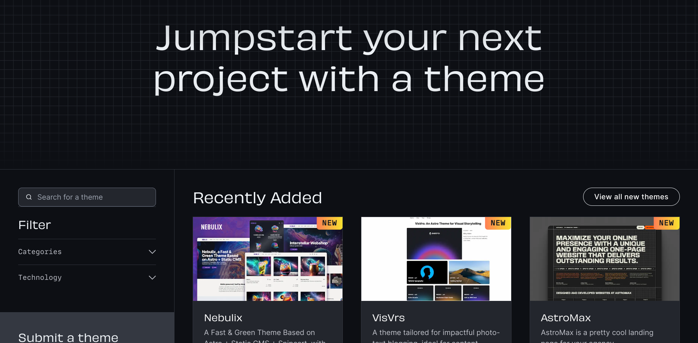
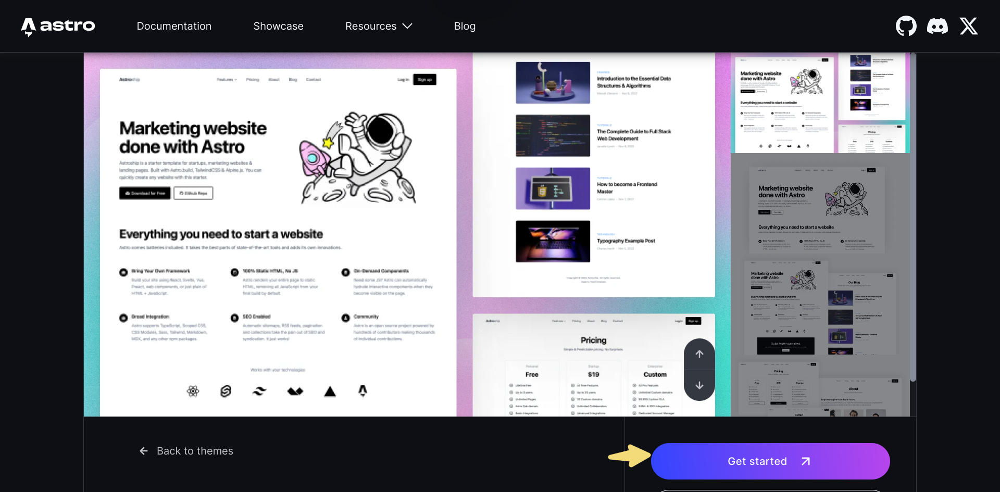
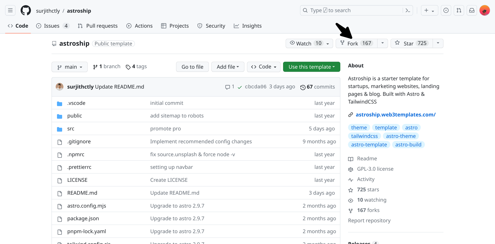
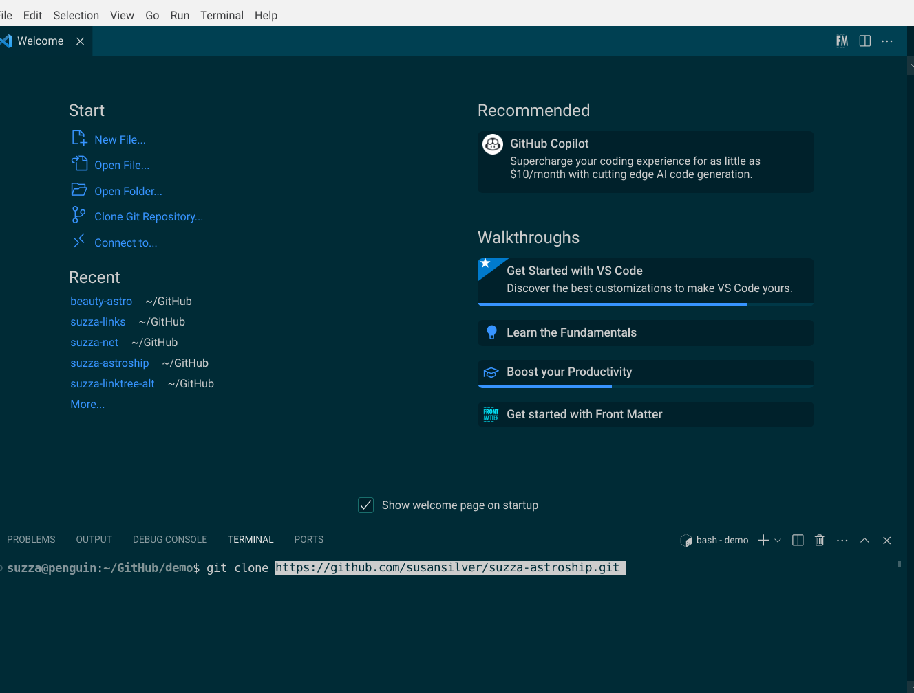
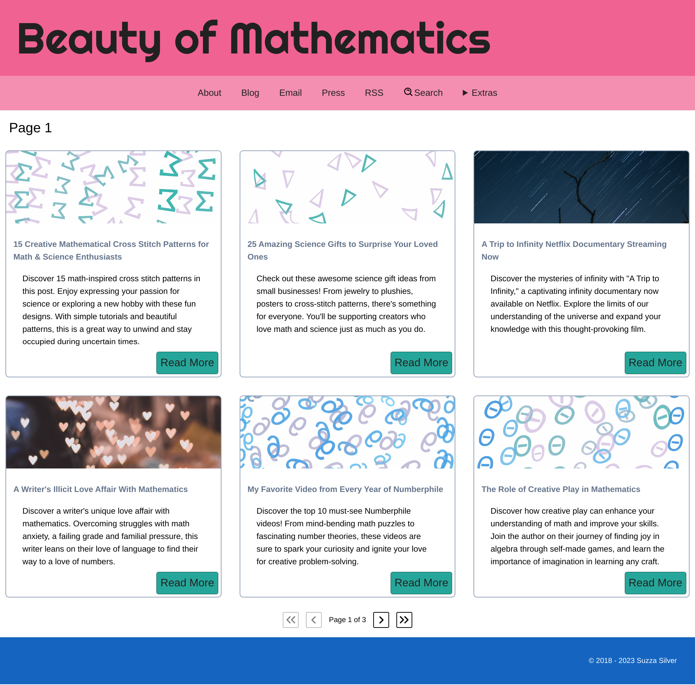

A theme is like the personality of your website. Colors and design speak volumes about who you are. How you want others to perceive you. It is nice when you can create your own but it isn’t necessary. You can customize a template to make it a little more interesting.

## Astro Themes

The easiest way to get started is to find a theme and fork it on GitHub. Astro has a showcase of [free and paid themes](https://astro.build/themes/). There are several solutions of interest here.

The variety will tell you about the many ways people use Astro. There are minimal blogs, marketing landing pages, agency websites, photography portfolios, shops, etc. 

This is the best option for people who want to make small cosmetic changes to them. Themes come with components that will cover most use cases. The basis for my website at [MathCommunications.com](https://mathcommunications.com/) is the[ Astroship theme](https://astro.build/themes/details/astroship/).

## How to Fork a Theme

- Go to [https://astro.build/themes/](https://astro.build/themes/) and choose a theme. 

- Go the the theme page and click on “Get started”

- On GitHub fork the theme

- Once forked go to VS Code and in the terminal clone your repo
- Click on “Code” and copy the URL from GitHub

)
- Go to the terminal in VS Code and navigate to the directory where you want to keep the files
- In the terminal use the command “git clone” then right-click and paste your URL

- cd into your newly created theme directory (it will have the same name as your repo)
- Use the command “npm install” to install dependencies

You will now be able to commit to the master branch of your repo for any changes. Including publishing new blog posts!

## Building My First Theme

Originally, my idea was to take a theme and add my custom design elements. Using it as a foundation to build on. 

### Astro Accelerator

The first one that I liked was [Astro Accelerator by Steve Fenton](https://astro.stevefenton.co.uk/). It is very solid. It has all the features that I was looking for! But, I learned something very quickly about using some themes.

Changing things like the colors or images is straightforward. But, messing with the code will be trouble. The issue I had was that I could not match the slugs of my articles to my WordPress ones. [Content collections](https://docs.astro.build/en/guides/content-collections/#overview) do this. When I added this feature the theme broke. 

It was unusable.

:::note
This was about the time of the introduction of Astro 2.0. The theme might be more compatible now. It is updated to the current version.
:::

### Accessible Astro Starter

The second theme that I wanted to use was [Accessible Astro Starter](https://astro.build/themes/details/accessible-astro-starter/). Upon view, it seemed like it wasn’t updated to Astro 2.0. This is the version that introduced content collections. Again, without using collections there wasn’t a way to get the URL correct for my articles.

:::note
I looked at it again before writing this chapter. Checking the package.json file, I can see that the version is Astro 3.0. Confusingly, the content for the blog is from an API with dummy data. You can replace that by [querying your blog collection](https://docs.astro.build/en/guides/content-collections/#:~:text=Querying%20Collections,-Section%20titled%20Querying&text=Astro%20provides%20two%20functions%20to,the%20collection%20as%20an%20argument.) instead. 

:::

### Developing an Original Theme

My best option was to make my own. Honestly, I was fooling myself here. The goal was always to re-create my WordPress theme in Astro. 

They say the third time's the charm.

I went to [Astro.new](https://astro.new/) and used the blog template. 

Here is the completed design. 

